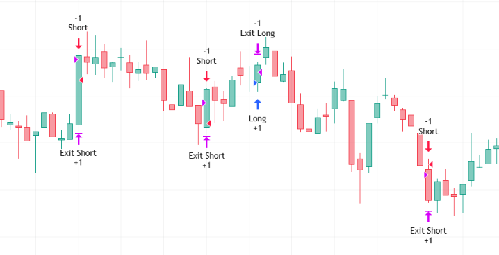

# Pine-Script-Multi-Timeframe-Entry-Strategy
Automated quantitative trading strategy synchronizing 1-minute EMA 5/60 trend alignment, 1-minute MACD zero-line momentum, 1m & 3m RSI thresholds, and 10-minute Stochastic %K/%D cycle crossovers. Features dynamic limit order pricing, maker post-only optimization, tick-based TP/SL brackets, and structured JSON webhook alerts for crypto futures bots on TradingView.

--

## Chart Preview

--

## Motivation & Problem

- **Execution Slippage & Counter-Trend Micro Whipping**: Manual scalping and single-timeframe bot strategies frequently incur steep taker fees, suffer from execution slippage on market orders, and enter premature reversals without higher-period cycle confirmation.
- **The Core Goal**: To develop a fully automated, quantitative multi-timeframe strategy that pairs micro-trend momentum (1m EMAs, 1m MACD, 1m/3m RSI) with intermediate cycle timing (10m Stochastic crossover), utilizing maker limit pricing with post-only execution and automated JSON webhook payloads.

--

## Strategy Logic & Architecture

- This strategy executes rule-based quantitative trade entries by utilizing a **multi-timeframe confluence and automated execution engine**:

### Core Components:
1. **1-Minute Micro-Trend & Momentum Alignment**:
  - **EMA Trend Filter**: Requires fast 1m EMA 5 to trade above slow 1m EMA 60 for longs ('ema_fast_1m > ema_slow_1m'), or below for shorts.
  - **MACD Zero-Line Filter**: Evaluates 1m MACD (Fast 7, Slow 26, Signal 9) to confirm positive momentum ('macd_line_1m > 0') for longs or negative momentum ('macd_line_1m < 0') for shorts.
  - **1m RSI Momentum**: Validates that 1m RSI (length 7) exceeds 52 for longs or drops below 42 for shorts.

2. **3-Minute Intermediate RSI Confirmation**:
  - Gathers 3-minute RSI (length 7) via 'request.security()' to ensure intermediate momentum agrees with the 1-minute impulse ('rsi_3m > 52' for longs, 'rsi_3m < 42' for shorts).

3. **10-Minute Stochastic Cycle Timing**:
  - Computes a 10-minute Stochastic oscillator (%K length 7, %D smoothing 3).
  - Acts as the primary execution timing trigger:
    - **Bullish Timing**: Confirmed when 10m %K crosses above %D ('ta.crossover(k_10m, d_10m)').
    - **Bearish Timing**: Confirmed when 10m %K crosses below %D ('ta.crossunder(k_10m, d_10m)').

4. **Automated Order Execution & Maker Fee Optimization**:
  - **Limit Order Offset**: Computes dynamic limit order entry prices offset from the current close ('limit_price_long = close * (1 - limit_offset_percent)') to ensure maker execution and capture rebates.
  - **Bracket Exit Management**: Converts user-defined Take Profit (default +0.1%) and Stop Loss (default -0.2%) percentages into exact contract tick units ('profit_ticks', 'loss_ticks') via 'syminfo.mintick', managed automatically through 'strategy.exit()'.

5. **Structured JSON Webhook Alerting**:
  - Dynamically synthesizes real-time JSON payloads containing ticker, side, type, quantity, limit price, take profit, stop loss, post-only flag, leverage, and position mode ("Cross" / "Isolated") ready for direct webhook dispatch to execution bots (e.g., 3Commas, Bybit, Binance).

--

## Configurable Parameters

Users can adjust the following parameters inside TradingView's settings panel:

- **Risk & Position Settings**: Default - Take Profit (0.1%), Stop Loss (0.2%), Limit Order Offset (0.0001%), Order Quantity (10.0 USD), Enable Post-Only (True).
- **Futures Execution Settings**: Default - Leverage Multiplier (10x), Position Mode ("Cross" / "Isolated").
- **1-Minute Indicators**: Fast EMA (5), Slow EMA (60), MACD (Fast 7, Slow 26, Signal 9), RSI (Length 7).
- **Multi-Timeframe Inputs**: 3-minute RSI (Length 7, Level 52 / 42), 10-minute Stochastic (%K 7, %D 3).

--

## How to Install & Use in TradingView

1. Open any crypto futures chart (e.g., `BTCUSDT.P`) on **[TradingView](https://www.tradingview.com/)**.
2. Open the **`Pine Editor`** console at the bottom of the page.
3. Open `Multi-Timeframe-Strategy.txt` (or your Pine Script file), copy the source code, and paste it into the editor.
4. Click **`Save`** and then click **`Add to Chart`**.
5. Inspect backtest metrics in the **`Strategy Tester`** tab and set up webhook alerts using `{{strategy.order.alert_message}}` for automated bot execution.

--

## Key Learnings & Engineering Reflections

1. **Precision Tick-Distance Risk Brackets ('syminfo.mintick')**
  - I learned that calculating take profit and stop loss exits by converting percentage price targets into discrete contract ticks ('math.round((close * profit_percent) / syminfo.mintick)') prevents exchange order rejection due to invalid price step increments.

2. **Maker Fee Capture via Limit Order Offsets & Post-Only Flags**
  - I learned that placing limit orders slightly behind current market price with a configurable offset and a 'post_only: true' flag optimizes crypto futures scalping by avoiding costly market taker fees and securing liquidity maker rebates.

3. **Dynamic JSON Payload Formatting for Webhook Bot Integration**
  - I learned how to build parameterized JSON payload strings within Pine Script alerts that automatically inject live entry prices, bracket TP/SL levels, and position modes, creating a frictionless bridge between TradingView strategies and automated exchange webhooks.
